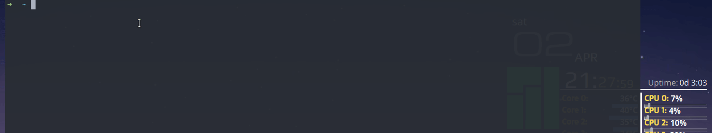

## Fcitx5 classicui switcher

对于使用 fcitx-rime 的小鹤音形用户来说，打字的候选窗通常是没有必要的，只有在使用通配符或查看各键位部件及小字根等需要候选窗显示内容时才需要开启候选窗。为了方便快速地开启或关闭打字候选窗，我简单地写了该脚本，如有需要它还可以配合桌面的全局快捷键使用。


<detail>
<summary>Example</summary>

</detail>

### Usage

```sh
# 1. clone this repo
git clone https://github.com/rovo98/fcitx5-classicui-switch

# 2. execute install.sh to install 
cd fcitx5-classicui-switch
./install.sh

# 3. Enjoy 
fcitx5-classicui-switch or fcs
```


### Note

对于隐藏打字的候选窗，通常有多种实现方案，如有将打字候选窗背景等一系列透明化、改 fcitx5 程序实现等。本脚本解决思路相对比较简单，直接利用 ``fcitx5--enable/--disable`` 配合``-r``来快速启用和停用 ``classicui`` 插件，从而达到隐藏打字候选窗的效果。

